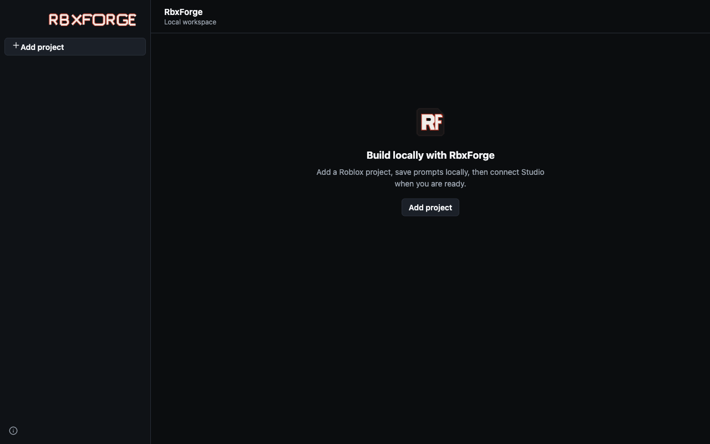

# RbxForge

RbxForge is a standalone, local-first macOS desktop app for organizing Roblox projects and chats and for
making explicit project-to-Rojo-to-Roblox Studio connections. It is not an IDE, a source editor, or a Roblox
Studio replacement.



The standalone MVP does not ask for an AI provider, API key, login, or model. Prompts are stored locally in
the selected chat, but this release does not make a model request or fabricate an assistant response.

This public repository contains a source-available Apple Silicon development prototype. It is `UNLICENSED`
and all rights are reserved; no permission to use, copy, modify, or distribute RbxForge is granted without
the copyright holder's prior written permission. Bundled dependencies retain the licenses recorded in
`THIRD_PARTY_NOTICES`.

RbxForge is an unofficial developer tool and is not affiliated with or endorsed by Roblox Corporation.

## First run

1. Install a Rojo CLI version in the range `>=7.7.0 <8.0.0`. RbxForge does not download Rojo. Make the
   executable available on `PATH`, in a supported tool location, or choose it from the connection sheet.
2. Launch the standalone **RbxForge** app.
3. Select **Add project** and choose a folder containing at least one `.project.json` or `.project.jsonc`
   Rojo project file. If the folder contains multiple candidates, select the intended file explicitly.
4. Open **Connect**. Use **Install Studio plugin**, restart Roblox Studio after a new or replaced plugin, and
   enable **Allow HTTP Requests** in **Game Settings → Security**. Keep only the matching main
   `MCPPlugin.rbxmx` variant enabled.
5. Connect the Studio MCP plugin to the primary loopback address shown by RbxForge, normally
   `http://127.0.0.1:58741`. Port `58741` is the primary connection. Legacy port `3002` is compatibility
   telemetry for old plugins and belongs only in troubleshooting; do not configure it as the normal RbxForge
   endpoint.
6. Start or reconnect the project so RbxForge shows an app-owned Rojo server such as
   `127.0.0.1:34872`. In the selected Studio window, manually connect the separate Rojo Studio plugin to that
   exact shown port, then check the handoff confirmation.
7. Select the exact fresh, edit-role Studio place in the RbxForge list and choose **Bind Studio**. RbxForge
   never selects a place merely because it is the only candidate.

RbxForge restores projects, chats, messages, drafts, and display settings after restart. It intentionally
does not restore a live Rojo lease, MCP broker identity, Studio connection, or binding; reconnect those
runtime boundaries each session.

## Local trust and current limits

- Use RbxForge only on a machine and account you trust. Its services bind to loopback and it trusts processes
  running as the same local OS user. The MCP launch token does not make the plugin registration and polling
  routes a hostile-user security boundary, and a catalog row is reported by the Studio plugin rather than
  cryptographic proof of Roblox Studio.
- Keep one Roblox Studio edit window open per published place. Upstream MCP normally exposes both windows as
  the same `place:<placeId>` identity and may hide the second registration, so RbxForge cannot detect or
  safely distinguish that duplicate.
- The Rojo handoff is manual. RbxForge can supervise its own Rojo process and show its port, but it cannot
  observe which Studio window's Rojo plugin attached to that server. The checkbox records your confirmation;
  it is not independent proof.
- **Studio bound** means RbxForge captured a fresh, explicitly selected Studio identity and your manual Rojo
  handoff confirmation. The standalone MVP performs discovery reads only. It does not mutate Studio objects,
  properties, source, assets, places, or Team Create state.
- Exact-bound, read-only Studio Inspector with lazy Explorer children and bounded Properties.
- The standalone MVP has no AI or model execution, source editor, terminal, filesystem tree, Studio writes,
  source display, Studio selection sync, full-tree prefetch or search, playtest control, publishing, asset
  upload, Rojo syncback, or autonomous write path.

## Open the unsigned macOS build

The `.dmg` contains an Apple Silicon app with an ad-hoc integrity signature. It has no Apple Developer ID
signature and is not notarized, so Gatekeeper may block the first launch.

1. Use only a `.dmg` you built yourself or received through a trusted local handoff. Open it and copy
   **RbxForge.app** to **Applications**.
2. Try opening RbxForge normally once.
3. If macOS blocks it, open Finder, Control-click **RbxForge.app**, choose **Open**, then choose **Open** in
   the confirmation dialog. If that option is not offered, go to **System Settings → Privacy & Security**,
   find the blocked RbxForge message, choose **Open Anyway**, and authenticate.

Do not disable Gatekeeper globally. A future notarized release should replace this local-development flow.

## Standalone source development

Use Node.js 24 and the pnpm version pinned by `packageManager`:

```bash
corepack enable
pnpm install --frozen-lockfile
pnpm format:check
pnpm lint
pnpm typecheck
pnpm test
pnpm build:desktop
```

Start the development desktop shell with:

```bash
pnpm dev:desktop
```

Build and inspect the unsigned Apple Silicon package on a Darwin arm64 host:

```bash
pnpm package:desktop
pnpm inspect:desktop
pnpm smoke:desktop
```

Packaging creates `artifacts/desktop/RbxForge-0.1.0-arm64.dmg` and copies the verified handoff artifact to
the workspace-level `outputs/` directory. The package command audits the whole app bundle against external
pinned-Electron and curated-resource evidence that inspection independently regenerates, exact POSIX modes,
signature-independent Mach-O code digests, the ASAR and native SQLite inventories, fuses, architecture,
ad-hoc signature, packaged runtime smoke, and every mounted-DMG bundle byte and mode before that copy.

See [architecture](docs/architecture.md) and the
[manual Studio verification checklist](docs/manual-studio-verification.md).

## Legacy VS Code extension development

The repository still contains the earlier VS Code extension as migration reference and for regression
testing. It is secondary development material, not the standalone product, and its VSIX is excluded from the
desktop app and DMG.

To run the legacy shell, open the repository root in VS Code and start **Run RbxForge Extension** from Run and
Debug. The checked-in launch configuration builds first and opens an Extension Development Host with
`apps/extension` as the development extension. The extension requires VS Code 1.100 or newer and a local,
trusted, file-backed workspace; remote, virtual, and untrusted workspaces are unsupported.

The legacy extension includes views for project/Rojo control, live Studio inspection, approved mutations,
playtest observability, and an optional Responses-compatible agent. Those capabilities and their
`SecretStorage`-backed provider setup belong only to the extension and must not be attributed to the
standalone MVP.

Build and inspect its development-only VSIX with:

```bash
pnpm build
pnpm package
pnpm package
pnpm inspect:vsix
pnpm scan:secrets
```

The second package run compares the sorted VSIX inventory and entry digests with the previous run. The
extension packager and desktop packager share the same audited Studio MCP inputs, but produce independent
artifacts and runtime boundaries.
